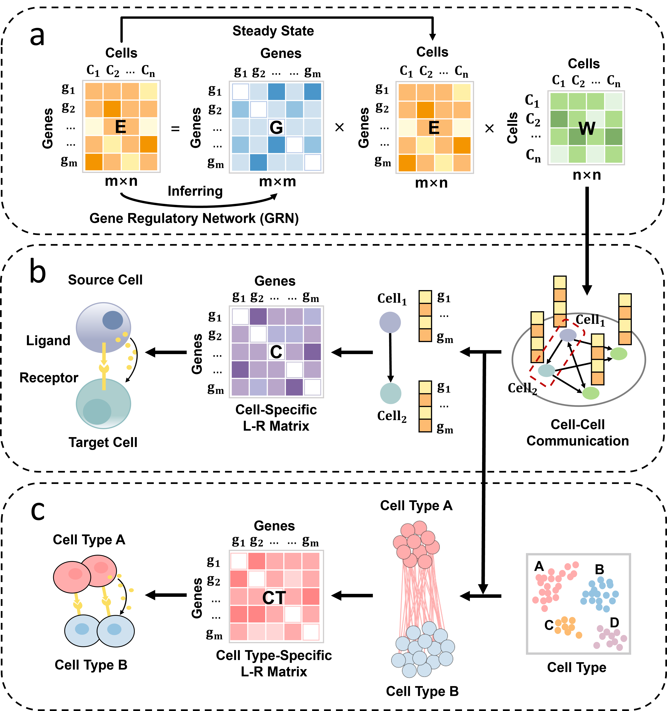

# CellSpecLR

Cell-Specific Ligand-Receptor Pair Prediction Algorithm



## How to use CellSpecLR

We provide two choices to use CellSpecLR:

1.You can download the code from github to run the main.py example.

2.You can download the CellSpecLR Python package to use the CellSpecLR algorithm. CellSpecLR Python package can be easily installed:

```
pip install CellSpecLR
```

You can run the CellSpecLR python package by running the test.py example.
